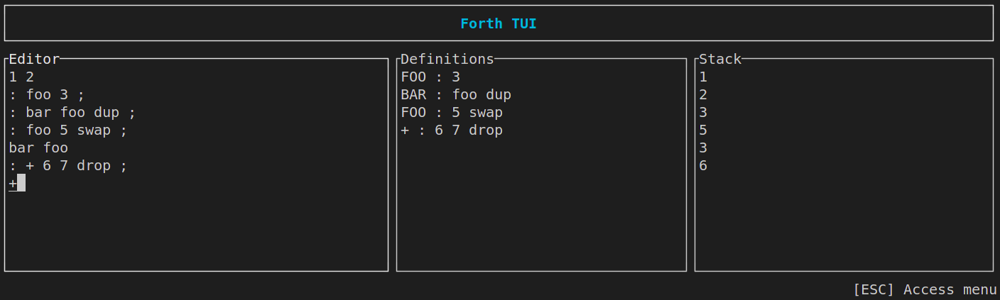

# (partial) Forth TUI in Rust

This a side project to learn more Rust 🦀.

I completed the [Forth exercise on Exercism](https://exercism.org/tracks/rust/exercises/forth), which is implementing a small subset of Forth in Rust.

Then I went on to create a minimal terminal app to play with my partial Forth implementation 🥳 !

With this app, you can :

- Push signed integers onto the stack
- Perform maths operations on the stack ```(+ - * /)```
- Manipulate stack with built-in words : ```DUP DROP SWAP OVER```
- Define or redefine words using built-in or previously defined words and values. Hell, you can even redefine buil-tin words or maths operators if you feel crazy 😂
- Switch between edit mode and menu with the Esc key.

Here is how it looks like :


I used [tui-rs](https://github.com/fdehau/tui-rs) for building the app and [tui-textarea](https://github.com/rhysd/tui-textarea) to provide a nice simple multi-line editor.

I am still learning, so if you feel like it, feel free to give feedback to help me write better rust ❤️

Happy 2023 !
